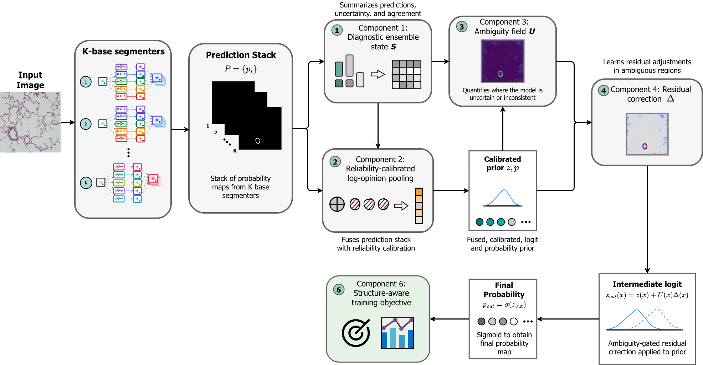
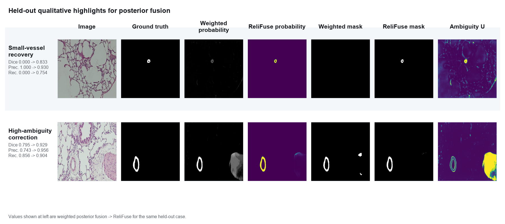
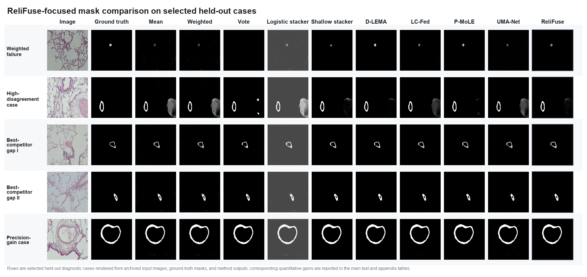
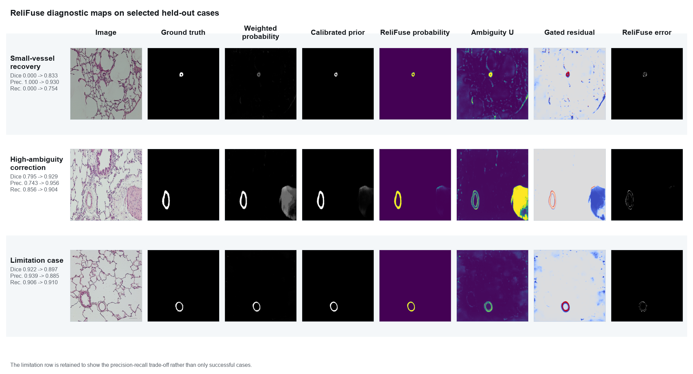

# ReliFuse

**ReliFuse** is a reliability-calibrated posterior-fusion method for histological vessel segmentation. It combines probability maps from frozen segmentation experts, learns which expert is locally trustworthy, and only adjusts the fused posterior where the ensemble is ambiguous. The RGB image is never reused by the fusion head.

<p align="center">
  
</p>

## Method

ReliFuse receives a fixed expert stack $P\in[0,1]^{B\times K\times H\times W}$ and performs four steps:

1. **Diversity-aware selection** builds a compact set of competent but non-redundant experts.
2. **Diagnostic state extraction** summarizes consensus, minority evidence, disagreement, entropy, and boundary risk in nine interpretable channels.
3. **Reliability-calibrated log-opinion pooling** forms a calibrated prior from bias-corrected expert logits, anchored by validation Dice priors.
4. **Ambiguity-gated residual correction** applies a bounded correction only where needed:

$$z_{\mathrm{out}}(x)=z(x)+U(x)\Delta(x).$$

The fusion head is trained with segmentation, boundary, consensus-preservation, sparse-correction, and calibration losses; all base experts remain frozen.

<p align="center">
  
</p>

## Results

Experiments use **517 development images** and **92 held-out test images** from the pulmonary histology benchmark. Posterior-fusion methods receive the same diversity-aware seven-expert probability stack. Values are held-out batch-level mean ± standard deviation.

| Method | Dice ↑ | IoU ↑ | Precision ↑ | Recall ↑ |
|---|---:|---:|---:|---:|
| Weighted fusion | 0.9187 ± 0.0244 | 0.8505 ± 0.0414 | 0.9233 ± 0.0305 | 0.9152 ± 0.0365 |
| D-LEMA | 0.9225 ± 0.0210 | 0.8568 ± 0.0361 | 0.9193 ± 0.0328 | 0.9268 ± 0.0290 |
| LC-Fed | 0.9223 ± 0.0222 | 0.8565 ± 0.0379 | 0.9219 ± 0.0325 | 0.9239 ± 0.0316 |
| P-MoLE | 0.9222 ± 0.0210 | 0.8562 ± 0.0361 | 0.9145 ± 0.0318 | 0.9311 ± 0.0292 |
| **ReliFuse** | **0.9241 ± 0.0139** | **0.8591 ± 0.0241** | 0.9194 ± 0.0299 | 0.9297 ± 0.0188 |

*ReliFuse is the selected lightweight boundary-aware configuration; comparator rows follow the manuscript's final all-method evaluation.*

ReliFuse achieves the strongest Dice and IoU among the evaluated posterior-fusion methods. Compared with validation-weighted fusion, it improves Dice by **0.0054**, IoU by **0.0086**, and recall by **0.0145**. Diversity-aware selection also improves ReliFuse Dice from **0.9198** with Top-7 experts to **0.9241**. Differences among the strongest learned methods are modest and are not always statistically significant.

<p align="center">
  
</p>

The selected cases illustrate small-vessel recovery and ambiguity-aware removal of false-positive regions. Quantitative claims are based on the complete held-out evaluation, not these examples.

<details>
<summary>All-method mask comparison and additional diagnostics</summary>





</details>

## Minimal usage

```bash
python -m pip install -e .
```

```python
from relifuse import ReliFuse, TrainingConfig, expert_dice_scores, fit, seed_everything

quality = expert_dice_scores(val_predictions, val_targets, batch_size=8)
seed_everything(42)
model = ReliFuse(num_experts=train_predictions.shape[1], expert_scores=quality)

fit(
    model,
    train_predictions,
    train_targets,
    val_predictions,
    val_targets,
    config=TrainingConfig(epochs=50, batch_size=4, patience=10),
)

fused_probability = model.fuse([expert_1_probability, expert_2_probability])
```

See the executed [two-expert notebook](notebooks/relifuse_two_experts.ipynb) and [reproducibility protocol](docs/reproducibility.md).

## Citation

> Truong P. Le et al. *ReliFuse: Reliability-Calibrated Posterior Fusion for Histological Vessel Segmentation*.

Citation metadata is available in [CITATION.cff](CITATION.cff). This project is released under the [MIT License](LICENSE).
