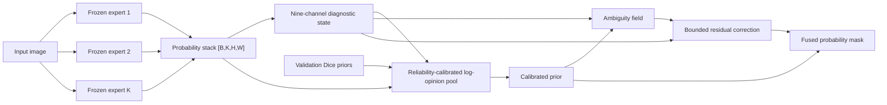

# ReliFuse

ReliFuse is a trainable **posterior-fusion head** for binary segmentation. It receives probability masks from frozen segmentation experts—never the source RGB image—and returns a reliability-calibrated fused posterior.

This repository is organized as a small reusable library. The main path is intentionally model-agnostic: bring predictions from two, seven, or any number of existing segmenters; fit ReliFuse on a development split; then reuse the saved fusion checkpoint at inference time.

> Status: research release candidate. The implementation follows the attached manuscript's nine-channel diagnostic state and selected lightweight boundary-aware configuration. Paper checkpoints and the pulmonary histology dataset are not bundled.

## Why this release is library-first

The paper's base-model pipeline is useful for reproducing one experiment, but ReliFuse's reusable contribution begins after those models emit probability maps. Keeping that boundary explicit makes the repository useful outside pulmonary histology and prevents dataset paths, Kaggle state, and multi-gigabyte checkpoints from becoming hidden requirements.

The package still includes the scientific pieces needed to retrain the fusion head:

- validation-derived expert quality priors;
- the nine diagnostic channels from the manuscript;
- reliability-calibrated log-opinion pooling;
- ambiguity-gated bounded residual correction;
- the complete structure-aware objective;
- optional diversity-aware expert selection;
- early stopping, checkpoint I/O, CLI, tests, and an offline two-expert notebook.

## Architecture



## Install

```bash
git clone <your-repository-url>
cd relifuse
python -m venv .venv
source .venv/bin/activate
python -m pip install -e ".[demo,dev]"
```

Core installation only needs NumPy and PyTorch:

```bash
python -m pip install -e .
```

## Quick start: fuse your own masks

ReliFuse expects **probabilities in `[0,1]`**, not thresholded masks or logits. The expert order must stay fixed between training and inference.

```python
import torch

from relifuse import (
    ReliFuse,
    TrainingConfig,
    expert_dice_scores,
    fit,
    save_checkpoint,
    seed_everything,
)

# Cached arrays: train/val predictions [N,K,H,W], targets [N,H,W].
train_predictions = torch.load("train_posteriors.pt", weights_only=True)
train_targets = torch.load("train_targets.pt", weights_only=True)
val_predictions = torch.load("val_posteriors.pt", weights_only=True)
val_targets = torch.load("val_targets.pt", weights_only=True)

# batch_size=8 reproduces the paper's validation-prior metric protocol.
quality = expert_dice_scores(val_predictions, val_targets, batch_size=8)
seed_everything(42)  # Seed before constructing the trainable fusion head.
model = ReliFuse(num_experts=train_predictions.shape[1], expert_scores=quality)

history = fit(
    model,
    train_predictions,
    train_targets,
    val_predictions,
    val_targets,
    config=TrainingConfig(epochs=50, batch_size=4, patience=10),
)
save_checkpoint(
    "checkpoints/relifuse.pt",
    model,
    expert_names=["expert_a", "expert_b"],
    metadata={"history": history.to_dict()},
)

# At inference, a Python list is accepted directly.
final_probability = model.fuse([expert_a_probability, expert_b_probability])
final_mask = model.fuse(
    [expert_a_probability, expert_b_probability], threshold=0.5
)
```

Binary masks are technically valid inputs, but they discard the confidence and calibration information used by log-opinion pooling. Probability maps are strongly recommended.

## Two-expert notebook

[`notebooks/relifuse_two_experts.ipynb`](notebooks/relifuse_two_experts.ipynb) is an offline example with two lightweight toy segmentation models. It generates their posterior masks, derives validation priors, trains ReliFuse, and visualizes the fused output and ambiguity field. The toy models keep the example self-contained; replace them with your own frozen models without changing the ReliFuse calls.

The same workflow is executable without Jupyter:

```bash
python examples/two_expert_demo.py
```

## Array CLI

Train from cached NumPy arrays:

```bash
relifuse train \
  --train-predictions train_predictions.npy \
  --train-targets train_targets.npy \
  --validation-predictions val_predictions.npy \
  --validation-targets val_targets.npy \
  --expert-name model_a --expert-name model_b \
  --output checkpoints/relifuse.pt
```

Fuse one mask per expert, in checkpoint order:

```bash
relifuse fuse \
  --checkpoint checkpoints/relifuse.pt \
  --mask model_a_probability.npy \
  --mask model_b_probability.npy \
  --output fused_probability.npy
```

## Reproducing the method rather than only calling it

Use a development partition that is disjoint from the final test set:

1. Train or load base segmenters.
2. Cache their probability maps with a stable channel order.
3. Derive expert priors on validation data only.
4. Fit ReliFuse on development posteriors and select its checkpoint on validation data.
5. Freeze everything and evaluate the held-out test set once.

The trainer selects the checkpoint with the **lowest validation loss**, matching Appendix H. Validation Dice is logged only as a convergence diagnostic.

For the paper's expert-selection study, pass fold-wise Dice/recall tables and cached predictions to `select_experts(...)`. See [`docs/reproducibility.md`](docs/reproducibility.md) for protocol details.

## Repository layout

```text
src/relifuse/       paper-aligned package and CLI
tests/              fast unit and training smoke tests
examples/           executable two-expert demo helpers
notebooks/          thin end-to-end example notebook
docs/               method, protocol, and architecture notes
```

Locally, all historical `results_v*`, old model weights, and the pre-ReliFuse MMF pipeline are grouped under `research_archive/`. That directory, cached masks, datasets, and generated outputs are intentionally excluded by `.gitignore`.

## Validate the release

```bash
make test
make lint
make format-check
```

## Citation

If this code supports your research, cite the accompanying manuscript:

> Truong P. Le et al. *ReliFuse: Reliability-Calibrated Posterior Fusion for Histological Vessel Segmentation*.

The machine-readable author list is in [`CITATION.cff`](CITATION.cff). Publication venue, year, DOI, and repository URL should be added there once final.

## License

MIT. See [`LICENSE`](LICENSE).
